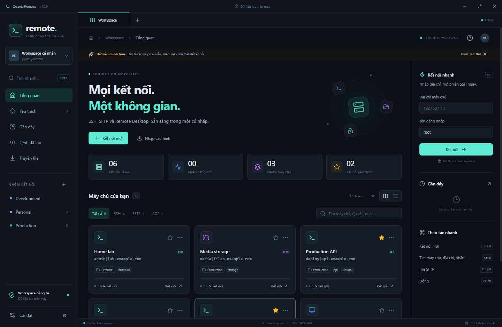

# QuanLyRemote

**Một workspace Windows cho SSH, SFTP và Remote Desktop.** Giao diện tối/sáng, tiếng Việt/English, tìm kiếm nhanh và thao tác bằng phím tắt.



## Tải và chạy

Tải từ [GitHub Releases](https://github.com/vietcuongus/QuanLyRemote/releases):

- `QuanLyRemote-1.0.1-x64-setup.exe`: bộ cài, chọn thư mục cài đặt, tạo shortcut.
- `QuanLyRemote-1.0.1-x64-portable.exe`: chạy trực tiếp, không cần cài Node.js hoặc phần mềm terminal khác.

Yêu cầu **Windows 10/11 64-bit**. RDP sử dụng Windows Remote Desktop (`mstsc.exe`). Ứng dụng khởi đầu với workspace trống; “Khám phá giao diện” hiển thị các máy chủ mẫu được đánh dấu rõ và không kết nối tới chúng.

## Đã có trong v1

| Tính năng | Hoạt động |
| --- | --- |
| Quản lý kết nối | Thêm, sửa, nhân bản, xóa; nhóm, nhãn, yêu thích, lịch sử; tìm tên/host/user/nhãn; chế độ lưới/danh sách |
| SSH | Terminal nhiều tab, PTY, Unicode, resize, tìm trong terminal, sao chép vùng chọn, keepalive, kết nối lại |
| Xác thực | Mật khẩu, khóa riêng OpenSSH/PEM có passphrase, Windows OpenSSH agent |
| SFTP | Duyệt máy tính/máy chủ ở hai cột; tải lên/xuống; tiến độ và hủy; tạo thư mục, đổi tên, xóa file hoặc thư mục rỗng |
| RDP | Mở máy chủ đã lưu trong cửa sổ Windows Remote Desktop; Windows xử lý đăng nhập |
| Lệnh đã lưu | Lưu/sửa/xóa lệnh nhiều dòng; sao chép hoặc chèn vào terminal đang mở |
| Bảo mật | Xác minh dấu vân tay SSH; chặn khóa thay đổi; mật khẩu tùy chọn mã hóa bằng Windows DPAPI |
| Cấu hình | Dark/Light, Tiếng Việt/English, cỡ chữ terminal; nhập/xuất JSON không chứa mật khẩu |

## Bắt đầu trong một phút

1. Nhấn **Kết nối mới** (`Ctrl N`), chọn SSH / SFTP / RDP.
2. Điền tên, IP hoặc hostname, cổng, user và nhóm.
3. SSH/SFTP: chọn mật khẩu, khóa SSH hoặc SSH agent. Tùy chọn lưu mật khẩu được mã hóa, hoặc chỉ giữ trong bộ nhớ cho lần chạy hiện tại.
4. Nhấn **Lưu & kết nối**. Lần đầu, đối chiếu dấu vân tay máy chủ với quản trị viên rồi chọn tin cậy.
5. Trong phiên, chuyển giữa **Terminal** và **File SFTP**. Chọn file ở cột trái để tải lên, chọn file ở cột phải để tải xuống; nhấp đúp thư mục để đi vào.

“Kết nối nhanh” nhận hostname/IP, hoặc `hostname:port`, rồi mở biểu mẫu để xác thực và lưu. Với IPv6, nhập IP và cổng riêng trong biểu mẫu.

## Phím tắt

| Phím | Thao tác |
| --- | --- |
| `Ctrl K` | Command palette: tìm máy chủ hoặc chuyển màn hình; dùng ↑ / ↓ / Enter |
| `Ctrl N` | Kết nối mới |
| `Ctrl 1` | Workspace |
| `Ctrl Tab` / `Ctrl Shift Tab` | Chuyển tab |
| `Ctrl Shift F` | Mở SFTP của phiên hiện tại |
| `Ctrl W` | Đóng phiên hiện tại |
| `Ctrl V` / `Ctrl Shift V` / `Shift Insert` | Dán clipboard vào terminal SSH; có nút Dán trên thanh công cụ |
| `Ctrl Shift C` | Sao chép phần đang chọn trong terminal; `Ctrl C` vẫn ngắt lệnh |
| `Ctrl F` | Tìm trong terminal; Enter / Shift Enter chuyển kết quả |
| `Esc` | Đóng hộp thoại / palette / tìm terminal |

## Dữ liệu và bảo mật

- Workspace lưu trong `%APPDATA%\quanlyremote\workspace.json`; vị trí có thể khác nếu Windows đổi AppData. Có thể chỉ định thư mục riêng bằng biến môi trường `QLR_DATA_DIR`.
- Bản portable vẫn dùng AppData mặc định: portable nghĩa là không cần cài đặt, không có nghĩa mật khẩu di chuyển được giữa các máy.
- Mật khẩu/passphrase được mã hóa bằng `Electron safeStorage` / Windows DPAPI, gắn với tài khoản Windows. Nếu bỏ chọn lưu, thông tin xác thực chỉ ở bộ nhớ và mất khi thoát.
- File khóa SSH được đọc tại đường dẫn đã chọn, không sao chép vào workspace. Khóa `.ppk` cần chuyển sang OpenSSH/PEM.
- Khóa máy chủ được kiểm tra mỗi lần kết nối. Nếu khóa thay đổi, app chặn kết nối. Chỉ xóa khóa cũ trong Cài đặt sau khi xác minh với quản trị viên.
- JSON backup gồm cấu hình và lệnh đã lưu; không chứa mật khẩu, nội dung private key hoặc khóa máy chủ đã tin cậy. Nhập tạo ID mới, bổ sung vào workspace và xác thực lại máy chủ.
- File được truyền qua file `.part` rồi đổi tên khi hoàn tất. Hủy tải xuống giữ nguyên file đích. Mất mạng khi tải lên có thể để lại `.qlr-*.part` trên máy chủ. Máy chủ thiếu atomic rename có thể từ chối ghi đè; app giữ file gốc thay vì xóa trước.
- Badge `TCP` cho biết cổng có thể kết nối, không xác nhận SSH đã đăng nhập. “Đã kết nối” chỉ xuất hiện khi SSH/SFTP sẵn sàng.
- Renderer bật sandbox và context isolation, tắt Node integration; preload cung cấp API giới hạn, IPC kiểm tra nguồn gửi. Không tải font/script từ CDN.

Xem [hướng dẫn sử dụng](docs/USER_GUIDE.md) và [phạm vi kiểm thử](docs/VALIDATION.md).

## Chạy từ source

Yêu cầu Node.js **24 LTS**, npm, Windows 10/11 x64.

```sh
npm ci
npm run dev
```

```sh
npm test              # unit + integration SSH/SFTP qua server localhost
npm run build         # build production
npm run test:desktop  # mở Electron, kiểm tra UI + SSH/SFTP + DPAPI
npm run dist          # tạo bộ cài + portable trong release/
npm run test:portable # kiểm tra khởi động file portable .exe
```

Kiểm thử bản đóng gói (PowerShell):

```powershell
$env:QLR_SMOKE_EXE = (Resolve-Path '.\release\win-unpacked\QuanLyRemote.exe').Path
npm run test:desktop
Remove-Item Env:\QLR_SMOKE_EXE
```

Ảnh và workspace kiểm thử dùng thư mục riêng trong `artifacts/`, không thay đổi dữ liệu cá nhân. Kiểm thử desktop cần Windows có phiên đăng nhập đồ họa.

## Tham khảo thiết kế

| Dự án | Ý tưởng tham khảo |
| --- | --- |
| [UniTerm](https://github.com/ys-ll/uniterm) | Kết nối theo nhóm, workspace terminal + file transfer |
| [Tabby](https://github.com/Eugeny/tabby) | Terminal nhiều tab, phím tắt, quản lý thông tin SSH |
| [Electerm](https://github.com/electerm/electerm) | Kết hợp SSH / SFTP trong ứng dụng desktop |
| [ssh2](https://github.com/mscdex/ssh2) | Thư viện giao thức SSH/SFTP dùng trong backend |
| [xterm.js](https://github.com/xtermjs/xterm.js) | Terminal emulator dùng trong giao diện |

QuanLyRemote có UI và code riêng, không sao chép source/tài sản thương hiệu của ứng dụng tham khảo. V1 tập trung SSH/SFTP/RDP; chưa có split pane, jump host/tunnel, VNC, FTP, database, AI agent hoặc cloud sync.

## License

[MIT](LICENSE). Thông tin thư viện: [THIRD_PARTY_NOTICES.md](THIRD_PARTY_NOTICES.md).
